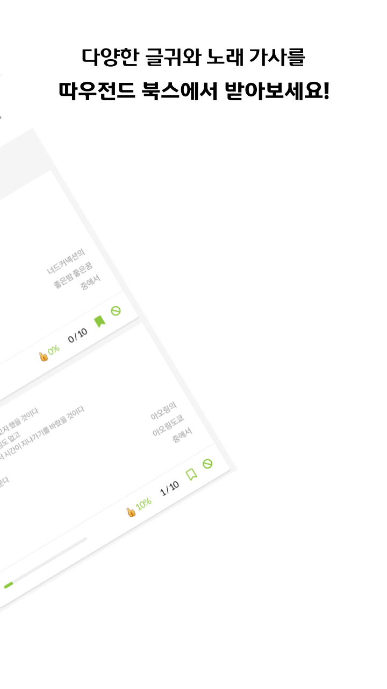

# 따북 Api ver 1.0

구글 앱스토어에서 서비스 했었던 따우전드 북스, 따북의 Backend 소스코드 입니다.

언어는 Kotlin, 프레임워크는 Spring Boot를 사용하였고

도메인 엔터티와 비즈니스 로직은 JPA / QueryDSL로 구현했습니다.

## 따북이란?
> 따우전드 북스 따북은 *'모티베이션'* 어플에서 착안한 웹앱입니다.

인스타그램이나 카카오톡 프로필 사진에 본인이 감명깊게 읽은 책 구절을 업로드 하는 사람들이 많아보여서

자신이 좋아하는 책 구절을 **다른 사람들과 공유**하고, 다른 사람이 올린 글을 내 **책갈피**에 꽂아두고, 꺼내보고

하루 3번 **푸시알림**으로 랜덤한 책 구절을 보내주는 기능을 구현했습니다.

단순한 CRUD의 비즈니스 로직이기에 대-단한 프로젝트라고 할 순 없지만

- 처음으로 홈 서버를 구축하고 배포 했다는 점
- 구글 Admob으로 광고를 삽입했다는 점
- 모바일 환경에서 구글 플레이 스토어를 통해 서비스 할 수 있었던 점

등등 많은 부분에서 애착이 가는 사이드 프로젝트 입니다.

아쉬운 점은 비용문제와 사진 업로드 서버 구축의 어려움 때문에

사진을 업로드하고 저장할 수 있는 클라우드 서비스나 s3 버켓을 활용하지 못한 점이 아쉽습니다.

이후 다른 사이드 프로젝트를 서비스 할 때는 사진까지 함께 공유할 수 있으면 좋겠습니다.

## Backend 개발환경

### Version
- Spring boot ver 2.5.4
- Gradle ver 6.9.1
- JAVA ver 11.0.15.1
- Kotlin ver 1.5.21
- JPA ver 1.5.21
- QueryDSL ver 1.0.10

## 배포환경 및 CI/CD
- Docker / Jenkins
- Ubuntu 22.04

## 제작기간
- 22.10.20 ~ 22.11.14

## 개발인원
- 1인 사이드 프로젝트

## 주요 구현 패러다임

> Rich Domain Model

Anemic Domain Model에서는 핵심 비즈니스 로직이 서비스 계층에 집중되어 있고

도메인 엔터티에는 Getter / Setter 역할만 하는, DB와 매핑하기 위한 역할로서의 VO만 남겨두었는데

이 경우 핵심 비즈니스 로직이 여러 서비스에 분산되어 있거나 중복되어 있기 때문에 유지보수가 어려워 진다.

이에 반해 Rich Domain Model은 핵심 비즈니스 로직을 Domain 엔터티에 둠으로서 데이터가 있는 곳에서 데이터 처리를 수행할 수 있고,

응집도가 높아지면서 결합도는 낮아져 유지보수가 용이해 진다.

> CQRS

Command Query Responsibility Segregation의 약자로 명령과 조회의 책임을 분리하는 패러다임이다.

데이터를 변경하는, CUD를 담당하는 Command와 데이터 조회만 담당하는 Query로 서비스 계층을 분리한다.

CQRS는 Rich Domain Model과 결합되어 Command의 관점에서 데이터 변경을 도메인 엔터티에서 담당하게 된다.

관심사가 분리되기 때문에 시스템의 유지보수를 더 쉽고, 유연하게 관리할 수 있다.

## 안드로이드 푸시알람 cron 서버

service 디렉토리에 firbase 디렉토리를 추가해 안드로이드 전용 푸시알람 서버를 구현했습니다.

Scheduler를 통해 정해진 시간마다 푸시알림을 보낼 수 있고

파이어베이스에 등록 한 어플들 중 특정 TOPIC 정보를 가진 앱들에게

푸시알림이 발송됩니다.

## 디렉토리 구조

```bash
├── api
│   ├── config
│   ├── controller
│   ├── dto
│   ├── filter
│   ├── intercepter
│   ├── service
│   │   ├── command
│   │   ├── query
│   │   ├── firebase
├── buildSrc
├── common
│   ├── domain
│   │   ├── _common
│   │   ├── config
│   │   ├── converter
│   │   ├── exception
│   │   ├── model
│   │   ├── repository
│───├── lib
│   │   ├── config
│   │   ├── error
│   │   ├── security
│   │   │   ├── jwt
│───│───├── utils
```
